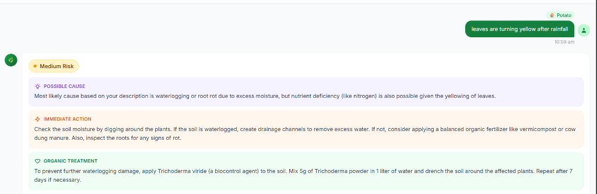
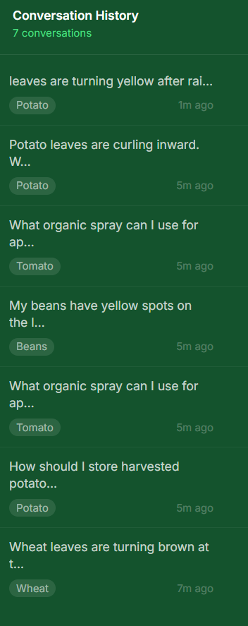
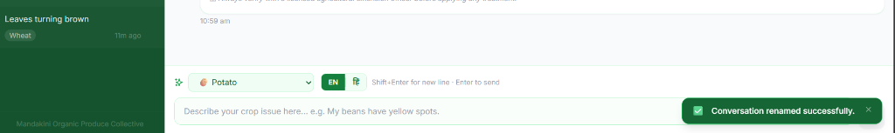
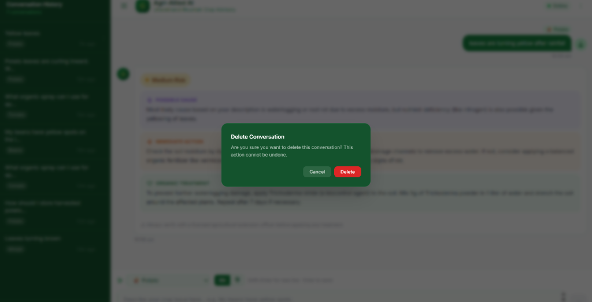
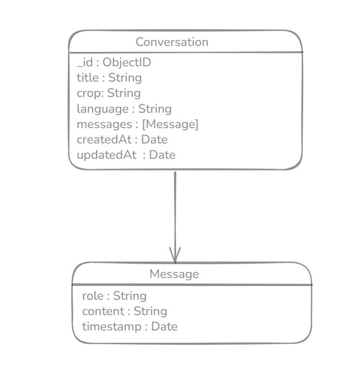

# Agri-Allied AI

> AI-powered crop advisory chatbot for organic mountain farming in Uttarakhand, India.

[](https://nodejs.org)
[](https://react.dev)
[](https://www.mongodb.com/atlas)
[](https://groq.com)
[](#license)

---

## Overview

Agri-Allied AI is a domain-locked advisory assistant for field supervisors of the **Mandakini Organic Produce Collective** (Uttarakhand, 800–2800 m). Supervisors describe a crop symptom in plain language and receive a structured, risk-triaged treatment plan in seconds — powered by LLaMA 3.3 70B via the Groq API.

Out-of-scope queries are refused entirely. Every response is classified by urgency (`Low` / `Medium` / `High`) and includes an organic treatment plan with an escalation threshold for when to contact a licensed extension officer.

---

## Features

- **Structured AI advisory** — LLM returns a strict JSON schema on every call; no free-form parsing
- **Risk triage** — every response carries a `riskLevel`: Low, Medium, High, or Unknown
- **Domain enforcement** — off-topic queries receive a structured refusal (`isWithinDomain: false`)
- **Organic-first** — system prompt prohibits banned pesticides and treatments hazardous to water/livestock
- **Conversation history** — all exchanges persisted to MongoDB; browsable via a history sidebar
- **Optimistic UI** — user messages appear instantly; AI response renders on API return
- **Rate limiting** — global 100 req/min; chat-specific 10 req/min per IP (configurable)
- **Graceful shutdown** — SIGTERM/SIGINT drain connections before process exit

---

## Tech Stack

| Layer | Technology |
|---|---|
| Frontend | React 18, Vite 5, Tailwind CSS 3.4, Axios |
| Backend | Node.js ≥ 18, Express 4.19, Helmet, Morgan, Joi, express-rate-limit |
| Database | MongoDB Atlas, Mongoose 8.4 |
| AI / LLM | Groq API, LLaMA 3.3 70B (`llama-3.3-70b-versatile`) |
| Dev Tools | nodemon, ESLint, Prettier |

---

## Project Structure

```
agri-allied-ai/
├── src/                        # Express backend
│   ├── server.js               # Entry point, graceful shutdown
│   ├── app.js                  # Express factory (Helmet, CORS, Morgan, routes)
│   ├── config/
│   │   ├── database.js         # Mongoose connection
│   │   └── groqClient.js       # Groq singleton client
│   ├── controllers/
│   │   └── chatController.js   # Route handlers
│   ├── services/
│   │   ├── groqService.js      # LLM call, JSON parse, fallback
│   │   └── conversationService.js  # MongoDB read/write
│   ├── models/
│   │   └── Conversation.js     # Mongoose schema
│   ├── routes/
│   │   ├── chat.routes.js      # POST /chat, GET /chat/history
│   │   └── health.routes.js    # GET /health
│   ├── middleware/
│   │   ├── rateLimiter.js
│   │   ├── validateRequest.js
│   │   └── errorHandler.js
│   ├── validators/
│   │   └── chat.validators.js
│   └── utils/
│       ├── AppError.js
│       ├── asyncHandler.js
│       └── responseFormatter.js
│
├── frontend/                   # React + Vite SPA
│   ├── src/
│   │   ├── api/chatApi.js
│   │   ├── hooks/useChat.js
│   │   ├── pages/ChatPage.jsx
│   │   └── components/         # Header, AdvisoryCard, HistorySidebar, QueryInput, …
│   └── tailwind.config.js
│
├── .env.example
└── package.json
```

---

## Installation & Setup

**Requirements:** Node.js ≥ 18, MongoDB Atlas account, Groq API key

```bash
# Clone the repo
git clone https://github.com/your-username/agri-allied-ai.git
cd agri-allied-ai

# Install backend dependencies
npm install

# Install frontend dependencies
cd frontend && npm install && cd ..

# Configure environment
cp .env.example .env
# Fill in MONGODB_URI and GROQ_API_KEY in .env
```

**Start development servers** (two terminals):

```bash
# Terminal 1 — Backend (port 5000)
npm run dev

# Terminal 2 — Frontend (port 5173)
cd frontend && npm run dev
```

Open **http://localhost:5173** — Vite proxies all `/api/*` requests to the backend.

---

## Environment Variables

Copy `.env.example` to `.env` and fill in the required values.

```env
NODE_ENV=development
PORT=5000

# Required
MONGODB_URI=mongodb+srv://<user>:<password>@cluster0.xxxxx.mongodb.net/agri_allied_ai
GROQ_API_KEY=gsk_xxxxxxxxxxxxxxxxxxxxxxxxxxxxxxxx

# Optional
GROQ_MODEL=llama-3.3-70b-versatile
GROQ_MAX_TOKENS=1024
GROQ_TEMPERATURE=0.3
RATE_LIMIT_WINDOW_MS=60000
RATE_LIMIT_MAX_CHAT=10
ALLOWED_ORIGINS=http://localhost:5173,http://localhost:3000
```

> **Never commit your `.env` file.** It is excluded by `.gitignore`.

---

## API Endpoints

| Method | Endpoint | Description | Rate Limit |
|---|---|---|---|
| `GET` | `/api/health` | Server and DB health check | Global |
| `POST` | `/api/chat` | Submit a crop advisory query | 10/min per IP |
| `GET` | `/api/chat/history` | Paginated conversation history | Global |

**POST `/api/chat` — request body**
```json
{ "query": "My beans have yellow spots.", "cropType": "beans" }
```

**Response**
```json
{
  "success": true,
  "data": {
    "conversationId": "...",
    "riskLevel": "High",
    "possibleCause": "Angular leaf spot (Pseudomonas syringae pv. phaseolicola).",
    "immediateAction": "Remove infected leaves. Stop overhead irrigation.",
    "organicTreatment": "1% Bordeaux mixture every 7 days for 3 cycles.",
    "whenToContactOfficer": "If spread exceeds 30% of canopy in 3 days.",
    "disclaimer": "Always verify with a licensed agricultural extension officer."
  },
  "meta": { "isWithinDomain": true }
}
```

**GET `/api/chat/history` — query params:** `?page=1&limit=20` (max limit: 100)

---

## Usage

1. Open the app at **http://localhost:5173**
2. Select a crop from the dropdown (optional but recommended)
3. Describe the crop problem in the text box and press **Enter**
4. The AI returns a structured advisory with a risk badge and organic treatment plan
5. Past queries are accessible from the **history sidebar** on the left

---

## Screenshots

### Advisory Card — Risk Triage & Organic Treatment Plan


### Conversation History Sidebar


### Query Input Bar & Crop Selector


### Delete Conversation Confirmation Dialog


### Data Model — Conversation & Message Schema


---

## Future Improvements

- [ ] Multi-language support (Hindi / Garhwali) for field supervisors
- [ ] Image upload for visual disease diagnosis
- [ ] Offline mode / PWA support for low-connectivity areas
- [ ] Export advisory as PDF for field records
- [ ] Admin dashboard for collective coordinators to audit advisory history

---

## License

Developed exclusively for the **Mandakini Organic Produce Collective**, Uttarakhand, India.
Not licensed for redistribution or commercial use.

All AI-generated advisories must be verified by a licensed agricultural extension officer before field application.
